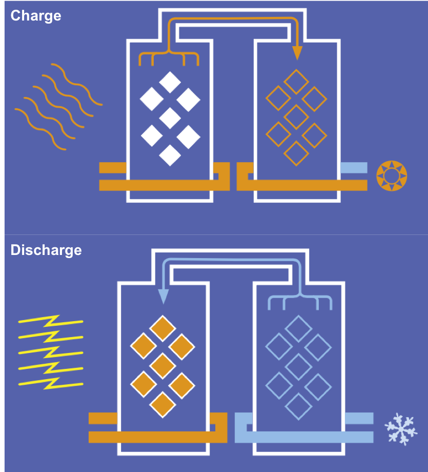

*This is part 3 of a series of character profiles on clean energy innovators.
I did this research in 2018 as an intern at the Environmental Defense Fund to support
an extraordinary mentor, [Dick Munson](https://www.richardmunson.com/), in 
unmasking some of the unsung pioneers fighting climate change. I'll be posting my writing here,
but you can find the final product on [medium](https://medium.com/the-fourth-wave/meet-the-innovators-battling-climate-change-d23b04642d0f).*

***Note that since the writing of this piece, Bolin has transitioned from his role as CTO of SaltX to Head of Innovation.***

Back in March 2018, EDF President Fred Krupp published an op-ed on the Wall Street Journal describing [Fourth Wave environmentalism](https://webreprints.djreprints.com/4346500706711.html): “Innovation that gives people new ways to solve environmental problems”.

While R&D exists on a continuum on the energy front, we’re seeing this Fourth Wave of innovation gain traction in real applications. As global demand for energy continues its inexorable hike, nations are adopting new technologies to boost and diversify their energy production capacities. Renewable energy is becoming economic, and concepts like beneficial electrification are gaining prominence.

That is not to say growing pains do not persist. Concerns about the variable production of energy from technologies like wind and solar call into question the ability of the electric grid to reliably balance supply and demand. Energy storage plays a vital role in maintaining the equilibrium of the grid, but what storage solutions exist that are clean, efficient, reusable and cheap?

> The ability to collect [renewable] energy is sometimes huge, but it doesn’t happen at the same time that the demand is huge.

Salt. We produce it. We consume it. We sweat it.

It’s said that if we extracted all the salt in our oceans and spread it uniformly across the Earth’s surface, the resulting layer would rise up 40 floors. Thanks to Göran Bolin, this ubiquitous family of compounds may hold the key to easing our energy storage woes.

Göran Bolin is about as close to a Swedish renaissance man as you’ll find. At 10 years old, most kids are just beginning to grasp electricity as a concept. He created a clock radio. In the 1970’s, he developed printing presses and bookbinding machines. Today, he’s a formidable presence in the energy sector, with hundreds of patents to his name. Oh – and did I mention he studied classical guitar in the University of Music and Performing Arts in Vienna?

Advanced age has done little to diminish Bolin’s stocky stature, which maintains a healthy build. A lightly wizened face holds the beady eyes of a man whose heart still lies in the research. Bolin has a hands-on approach to life – perhaps unsurprising considering his role as Chief Technology Officer.

Bolin entered the clean energy industry after acquiring a patent from a Finnish scientist. He went on to build Solsam Energy, a pioneer in the Scandinavian solar industry. Through a series of mergers and acquisitions, Bolin founded ClimateWell, a cleantech firm that provided solar cooling and heating solutions. This served as the foundation leading to Bolin’s most recent discovery, after which the company changed its name to SaltX Technology in 2016. 

SaltX’s pioneering approach to the storage problem developed in three waves of patents. Bolin played a key role, inventing and patenting “Matrix” and “Nano Coated Salt (NCS)”.

Matrix was a structural lattice developed to simplify the system, making it more economic and scalable. However, it’s the [nanocoated salt](https://patentimages.storage.googleapis.com/d2/8d/27/0eb9281977a8ad/US9459026.pdf) that is the crux of SaltX Technology. While the identity of the salt itself is flexible (even calcium oxide – a base – is proposed), the nanocoating is needed to prevent particles from agglomerating and clogging up the system. This maximizes the particle surface area available for chemical interactions, thereby increasing their energy density and cycle life.

Simply put, the energy storage solution developed by SaltX (EnerStore) works much like a large battery capable of thousands of charge/discharge cycles without losing efficiency. However, it’s a disruptive technology precisely because it can outperform a standard battery.

Any form of energy can be designed to heat and charge the salt system. In the charge state, the system uses energy to evaporate wetted nanocoated salt, separating dry salt in one chamber from condensed water in another. In the discharge state, a valve is opened to recombine the salt with water in an exothermic process, releasing thermal energy for reuse. The entire process takes place in a closed vacuum, allowing it to be repeated almost indefinitely. The patented nanocoating prevents the degradation of the salt system over time.

<figure>
  
  <figcaption>
    Exemplary SaltX energy storage (EnerStore) system
  </figcaption>
</figure>

With a basic understanding of chemistry, one can begin to grasp the value of such a system. The underlying ‘ingredients’ are easy to obtain; the apparatus are relatively straightforward to scale; the underlying physical process is a simple one. Thus, the disruptive power of this technology ultimately boils down to one characteristic – cost-effectiveness. Innovations that are reproducible and reliable in the long-term are rare, but SaltX relies largely on existing technology that has been researched and tested. This system may only return thermal energy, but at a significantly lower cost, making it a perfect storage option for large amounts of energy produced at generating sources such as solar and wind farms.

> We have our nanocoated salt patent… That is the secret behind having storage that can be accessed fast.

EnerStore is not the only project under development at SaltX Technologies. VerdAcc is a heating and cooling system being developed for trucks. HeatBoost aims to minimize household gas consumption. Already in full-scale production, SunCool represents SaltX’s own venture into thermal solar panels.

Elsewhere, Google X is developing a ‘moonshot’ project that similarly looks to salt as an energy storage solution. SaltX is already here. With proprietary trade secrets that set it aside from its competitors, SaltX Technologies can truly disrupt an industry.

We need clean, efficient, reusable and cheap energy storage solutions. SaltX might just be able to provide that – in bulk.