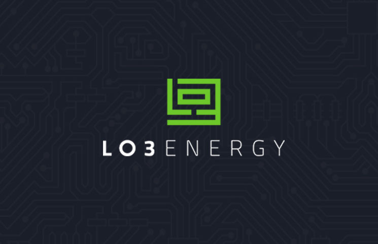
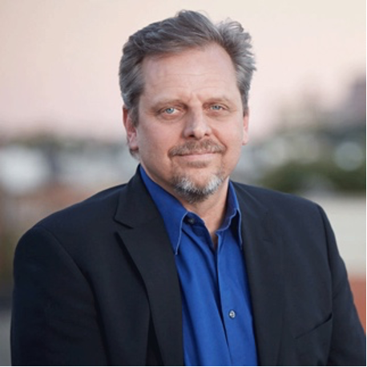
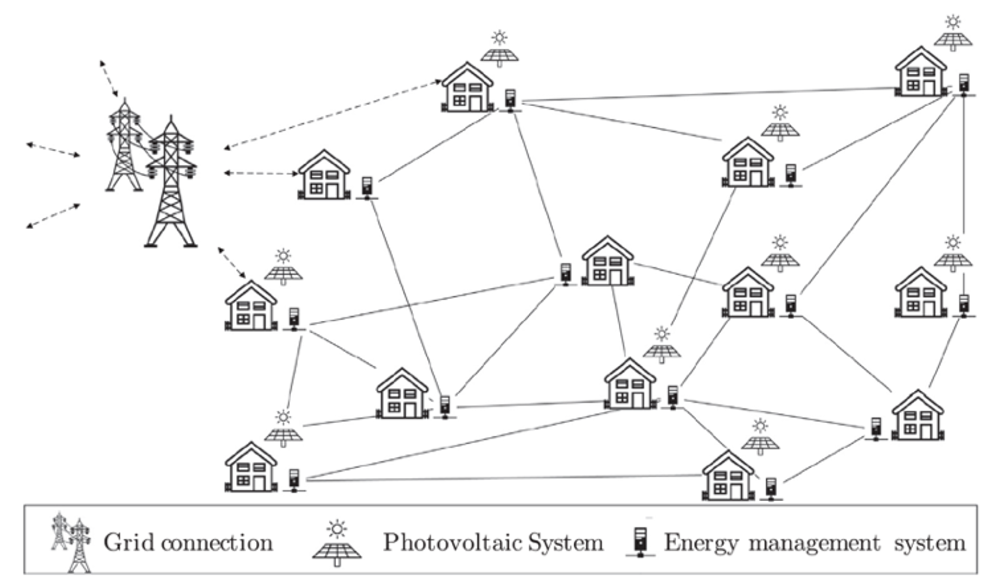

It's been more than a century since Edison
squared off against Tesla and Westinghouse in the so-called 'War of the
Currents', the lasting effects of which shaped the development of the
modern electrical grid. Today, utility companies manage some of the
largest infrastructure projects in the world.

Up until recently, consumers have not had much choice in opting into
this centralized system. Utility companies cut a monolithic figure in an
industry that still derives more than 80% of its capacity from coal, gas
and nuclear [energy sources in the United
States](https://www.eia.gov/tools/faqs/faq.php?id=427&t=3).

But the times they are a-changin'.

The introduction of distributed energy resources, the bulk of which are
renewable, poses a new set of challenges for aging utility grids that
are unable to efficiently account for changing [electrical load
profiles](https://www.energy.gov/eere/articles/confronting-duck-curve-how-address-over-generation-solar-energy).

Why do we continue to confine ourselves to these approaches? How else
can we reconcile an increasingly diverse energy portfolio?

No doubt these were some of the questions that spurred Lawrence Orsini to create [LO3
Energy](https://lo3energy.com/) in 2012.

Orsini got his start in the energy industry in 1999 working at Portland
Energy Conservation (PECI), a non-profit that designs, implements and
manages energy efficiency programs for clients ranging from Walmart to
the U.S. Department of Energy.

While Orsini developed an understanding of how businesses navigate the
regulatory environment, the energy industry continued to change around
him.

Reduced costs of distributed generation are paving the way for the
proliferation of
[microgrids](https://www.energy.gov/articles/how-microgrids-work). The
mass hysteria that surrounds cryptocurrencies presents another
opportunity in the form of [blockchain
technology](https://blockgeeks.com/guides/what-is-blockchain-technology/).

The utility industry may soon undergo a paradigm shift, and Orsini's LO3
Energy is positioning itself to take a starring role in the budding
distributed energy space.

Orsini's pioneering approach? Transactive energy.

> [Utility companies] need to see technologies like blockchain and local microgrids as an opportunity, not a threat.

Microgrid technology is inherently independent of existing utility
infrastructure, capable of operating autonomously in 'island mode'.
Naturally, it's been widely adopted as backup grids for hospitals,
shelters and government buildings that provide vital services during
emergency power outages.

It also provides an avenue for prosumers to tap into local resources
that are too small for traditional electric grids. LO3 leveraged this
fact to develop the [Brooklyn Microgrid
(BMG)](https://www.sciencedirect.com/science/article/pii/S030626191730805X?via%3Dihub),
a project that gives local communities a choice over where their power
comes from.

Prosumers in the BMG that invest in distributed energy (such as solar and wind) can sell
excess power back to the community. After all, why rely on power
transmitted from distant substations when you can buy it from your
neighbor? Orsini recognized that energy generated by a solar panel on
your roof is most efficiently consumed right there - in your local
community. This cuts down on transmission losses and creates a local
energy market tailored to the community's preferences.

To paraphrase LO3 Energy's Scott Kessler, technologies that reduce our
carbon footprint are becoming readily available, but there has yet to be
a good mechanism to incentivize them. A marketplace can accelerate the
adoption of clean distributed energy more effectively than the typical
grant or state funding.

While it's not Orsini's goal to *dictate* the sources that communities
decide to derive their energy from, the Brooklyn Microgrid has
demonstrated how such a model can promote renewable energy in this way.

However, the BMG isn't simply extending the sharing economy into the
energy sector. Customers that wish to use a ride-sharing service still
require the permission of an intermediary like Uber or Lyft. That isn't
the role that LO3 Energy wants to play.

Orsini's vision of transactive energy is underpinned by blockchain
technology. Used as a secure communications platform, it enables LO3
Energy to cut out the middle man. With peer-to-peer interactions
possible, the BMG represents a truly decentralized marketplace.

> We don’t have a problem producing energy, we have a problem making it into useful work.

With this success, LO3 Energy has gone on to pilot more projects in the
U.S., Australia and Germany. In doing so, Orsini has revealed a driving
focus on exergy - the thermodynamic concept linked with the useful work
that can be extracted from a process.

LO3's EXERGY project shifts the focus from the production of energy to
the production of work, by letting users securely access and share their
efficiency data. Ultimately, this data can be used to finetune the
community's electric grid.

Several roadblocks, many of which are policy-driven, continue to affect
this growing business. But LO3 Energy has few competitors. Rather than
challenging an established utility market, it's laying the foundations
for entirely new ones by providing the requisite software and hardware
to local communities.