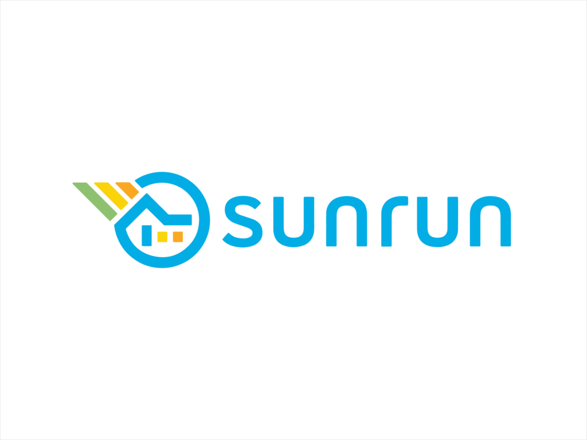
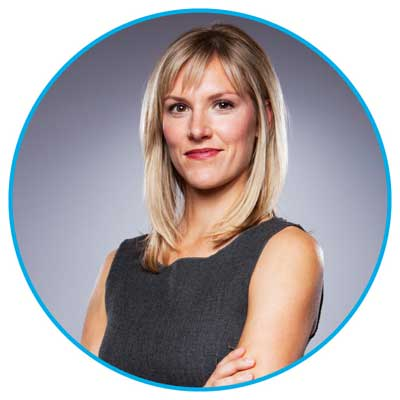
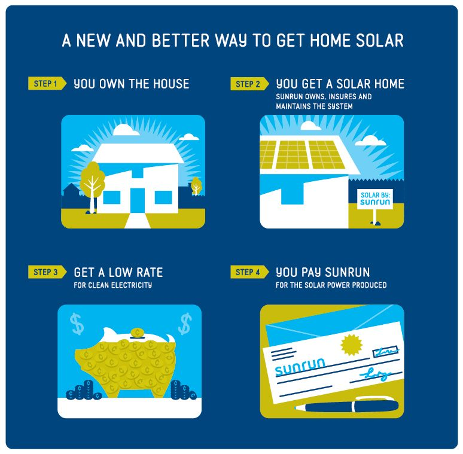

*This is part 5 of a series of character profiles on clean energy innovators.
I did this research in 2018 as an intern at the Environmental Defense Fund to support
an extraordinary mentor, [Dick Munson](https://www.richardmunson.com/), in 
unmasking some of the unsung pioneers fighting climate change.
I'll be posting my writing here, but you can find the final product on
[medium](https://medium.com/the-fourth-wave/meet-the-innovators-battling-climate-change-d23b04642d0f).*

***Note that since the writing of this piece, Jurich has transitioned from her role as CEO of Sunrun to a Co-Executive Chair.***

March 1931. An unlikely gathering between Thomas Edison, Henry Ford and Harvey Firestone sparks a spirited conversation about the future of the energy landscape. Ford wishes to harness the powerful tides in the Bay of Fundy. Firestone is drawn to the immense power of the wind. But Edison has a different idea: “I’d put my money on the sun and solar energy. What a source of power! I hope we don’t have to wait till oil and coal run out before we tackle that.”

It’s not hard to see where Edison was coming from. By one [estimate](https://www.businessinsider.com/this-is-the-potential-of-solar-power-2015-9?international=true&r=US&IR=T), an hour’s worth of incident solar flux is sufficient to power our world for an entire year. But more than 80 years on, we’re barely scratching the surface, with solar energy accounting for a measly [2.3% of U.S. electricity generation](https://www.eia.gov/tools/faqs/faq.php?id=427&t=3). 

Why is the solar industry such a tough market to break into, despite the allure of leveraging the Sun’s power? It appears the potential is there, but we struggle to follow-through.

When Lynn Jurich was still completing her MBA at Stanford, she made a bet with her husband-to-be. Both had dreams of launching their own startup; both wanted stability in their lives. They reached a compromise: whoever was presented with the best opportunity could chase their passion while the other settled for a stable job.

Jurich won that bet.

<figure>
  
  <figcaption>
    Lynn Jurich – Co-founder and CEO of Sunrun.
  </figcaption>
</figure>

The experience of a summer internship in China opened Jurich’s eyes to the appalling impacts of urban air pollution. Convinced of the fact that a clean environment is a basic human right, Jurich tackled the solar quandary from a different perspective.

For Jurich, expanding the adoption of solar energy was not a question of research and development. It was one of economics. Specifically, she recognized the importance of making solar financially accessible to residential consumers. Teaming up with a fellow business school graduate, Edward Fenster, Jurich started Sunrun in 2007 and built it into the single largest solar company dedicated to residential production, storage and maintenance.

> We got our start in an attic, but today Sunrun sits on the rooftops of thousands of homes.

Sunrun’s steady rise to the top can be largely credited to their ‘Solar as a Service’ business model. To win over potential customers, Sunrun eliminates the financial bottleneck associated with adopting solar: the cost of capital.

The upfront cost of purchasing a photovoltaic (PV) system is compounded by installation and maintenance fees. Depending on where you live, this pushes the [payback period of a PV system](https://pv-magazine-usa.com/2017/10/20/are-solar-panels-worth-it/) as far back as 10 years from origination. Perhaps unsurprisingly, this is discouraging to consumers. Sunrun’s alternative: it provides, installs and maintains integrated PV systems for little to no upfront cost. In return, customers allow access to their roof and purchase the solar power produced, often at a discount to traditional utilities. This pioneering approach employs [power purchase agreements](https://www.seia.org/research-resources/solar-power-purchase-agreements) (PPA), leases and/or prepaid contracts.

<figure>
  
  <figcaption>
    Sunrun BrightSave™ business model.
  </figcaption>
</figure>

As a relative mainstay in the solar industry today, Sunrun has evolved far beyond the bounds of the attic that used to house it. In just over 10 years, the company has swelled to house over 3000 employees serving 189,000 customers in 23 states. Its measured approach has ultimately [beaten out highly-publicized competitors such as SolarCity](https://www.investors.com/gdpr-agreement/?back_url=https%3A%2F%2Fwww.investors.com%2Fnews%2Ftechnology%2Fsunrun-overtakes-teslas-solar-city-as-top-solar-lease-firm%2F) in the residential leasing market. Now, the company is gaining the confidence to expand into new markets. In just under four months, Sunrun entered 7 new states to target 12 million candidates, nearly [doubling its total available market](https://investors.sunrun.com/).

The steady guiding hand of Lynn Jurich has much to do with the company’s successful navigation through a volatile industry landscape. A cursory glance paints a complex picture of Jurich’s character, which appears full of contradictions. A kind face frames a pair of steely eyes. A calm demeanor belies edge-of-the-seat passion. An affable tone does a poor job of concealing the powerhouse resume that lies behind those words.

> Founding a company doesn’t mean sitting in a cushy chair and giving orders. It means being in the trenches and spending your Saturday afternoons staffing a booth at a county fair to recruit customers.

During Sunrun’s infancy, Jurich landed one of her first customers standing next to a giant pumpkin at the Yolo County Fair in Sacramento. Intending to discuss her product with local homeowners, she found herself preaching to a sea of averted gazes. The few that paid attention seemed to do so just to shoot her down. But when she finally persuaded an owner of a trucking company to try solar, she realized the value of famer’s markets and county fairs. Here, she could receive quick and direct feedback, providing rapid learning cycles for her to improve her business. Indeed, Jurich would be the first to point to those experiences as being formative in the development of Sunrun.

Today, Sunrun is no longer a scrappy startup experimenting with a disruptive business model. Lynn Jurich was among the first to make solar energy accessible to the masses, and that has fueled the company’s growth so far. After all, she wasn’t in the business of technologically disrupting an industry – she just wanted to change our very conception of it.