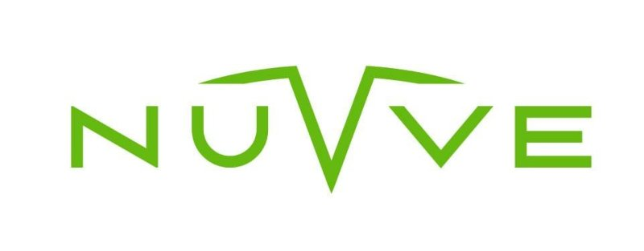
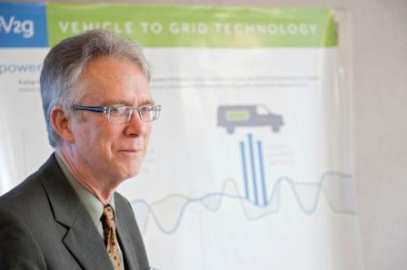

*This is part 4 of a series of character profiles on clean energy innovators.
I did this research in 2018 as an intern at the Environmental Defense Fund to support
an extraordinary mentor, [Dick Munson](https://medium.com/@dickmunson), in 
unmasking some of the unsung pioneers fighting climate change. Note that 
since the writing of this piece, Kempton has transitioned from his role 
as CTO of Nuvve to Chairman of the Tech. Advisory Board.
I'll be posting my writing here, but you can find the final product on
[medium](https://medium.com/the-fourth-wave/meet-the-innovators-battling-climate-change-d23b04642d0f).*

We shape much of our world around a society dominated by automobiles. Indeed, cities and towns across North America are planned around road infrastructure, as opposed to the people who inhabitant them. While our obsession with cars has contributed to a host of well-documented environmental concerns, it has also opened the door for clean-powered automobiles. Today, electric Vehicles (EVs) are gaining traction and headed towards widespread adoption, promising a move towards beneficial electrification.

Despite this, concerns have been raised over an expanding EV fleet’s impact on the utility grid. If enough EVs were charged simultaneously, the strain imposed on many local distribution networks could threaten the infrastructure with power shortages. Although [studies have shown such an event is unlikely to happen](http://blogs.edf.org/energyexchange/2013/11/18/pecan-streets-study-shows-electric-vehicles-wont-overload-the-electric-grid/), even remote possibilities of overloading the grid is enough to give policymakers pause. How can the beneficial electrification of transportation continue under such looming consequences? As presently constructed, the national grid would need 160 new power plants to come online between 2010 and 2020. Such a scenario would only serve to invigorate the [efforts of those like FirstEnergy](https://www.cleveland.com/business/2018/03/firstenergy_asks_doe_for_emerg.html), who seek to revive old coal and nuclear plants under the false pretenses of grid stability and national security.

The irony of such prospects was not lost on Willett Kempton, who began pioneering vehicle-to-grid (V2G) technology in 1996 in response to these problems. Bringing his solutions through proof of concept, he finally went on to co-found Nuvve corporation in 2010.

<figure>
  
  <figcaption>
    Willett Kempton – in addition to co-founding Nuvve Corporation, he’s also been a professor at University of Delaware’s College of Earth, Ocean & Environment since 1992.
  </figcaption>
</figure>

V2G technology implements a system in which plug-in EVs are programmed to communicate with the utility grid on a real-time basis. This allows the EVs to respond to utility demands by manipulating its rate of charging or, in the case of bi-directional systems, even selling electricity back to the grid.

> The concept of V2G basically is to create a bridge between the pool of energy used for transportation and electric energy.

The path to bringing V2G technology to market was not a short one, and Kempton had additional responsibilities as a professor at the University of Delaware. In fact, Kempton is the quintessential example of a career academic, with ties to six different institutions. While his B.A. at UVA and his PhD at UT Austin focused on Anthropology, Kempton supplemented those degrees with a strong background in electrical engineering and computer science. He followed those up by pursuing postdoctoral training at UC Berkeley and Princeton University. By 1992, he’d been offered the professorship at Delaware, a post that he has held for the last 26 years, breaking briefly only to serve as a guest professor at the Technical University of Denmark. By comparison, his 5-year tenure as CTO of Nuvve makes him a venerable spring chicken in the clean energy business. Judging by his studious tone, his frequent throat-clearing, and the deep parting of his hair, one could be forgiven for being ignorant of his entrepreneurial spirit.

Evidently, Kempton was driven by some strong incentives for over a decade to make V2G technology a reality. One of his main motivations is rooted in clean energy. In many of his lectures, he sees great potential in clean energy sources such as wind energy, but points to their inherently inconsistent productivity as a problem for the balancing of the utility grid. Kempton’s breakthrough came from reimagining the role of the car in this system.

For all our love of cars, the average time we spend driving each day is roughly an hour. That means our car remains parked as a lump of metal 95% of the time. However, if this car was a plug-in EV like the new Nissan Leaf, it would have the [capacity to store as much electricity as a hundred homes would demand on average in an hour](https://www.greentechmedia.com/articles/read/why-is-vehicle-to-grid-taking-so-long-to-happen#gs.rpd_zcg).

<figure>
  
  <figcaption>
    Nuvve's V2G system with their Grid Integrated Vehicle (GIVe)
  </figcaption>
</figure>

The tangible value of this is enticing. For one, balancing grid loads through ‘valley filling’ and ‘peak shaving’ would mitigate the issues Kempton brings up regarding clean energy production (e.g. [the duck curve](https://www.youtube.com/watch?v=YYLzss58CLs)). EVs connected to the grid in this way can effectively act as a buffer for renewable energy sources – storing the excess energy produced during peak production hours and supplying it back to the grid during periods of lower production. In addition, it would hurt the argument for public utilities to maintain expensive (and dirty) fossil fuel plants, as V2G could be leveraged to keep voltage and frequency stable through distribution networks. The possibility is even open for them to act as emergency sources of power during sudden demand surges or power shortages.

However, the proliferation of V2G adoption still faces some major obstacles. Most notably, studies are still being conducted to fully understand the impact of V2G services on battery longevity. With a finite number of charge cycles, batteries could have shorter shelf-lives due to V2G usage.

> By doing [V2G research], we’ll understand better how to make electric vehicles pay for themselves and make them support large-scale renewable energy in the future.

Nuvve offered the world’s first commercial implementation of a bi-directional V2G system. While it earns its revenues from arbitrage opportunities in load balancing, Nuvve shares profits with consumers. So, as an owner of a V2G-enabled EV, you could also reap the benefits of effectively becoming a participating member of the utility grid.

Therein lies the disrupting power of V2G technology. Kempton has found a way to address grid-wide barriers by leveraging us as individuals – converting us from passive consumers to prosumers.