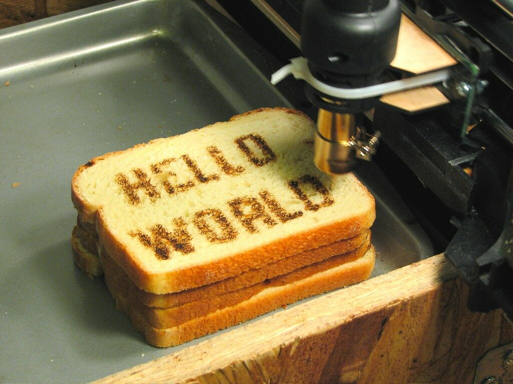

  Welcome to my first post! I will use this space to outline a
  roadmap of sorts for the direction of this platform. Hopefully, I can introduce
  and document my interests here as I explore them (or fall valiantly
  short of following through).

If you're here for an expertly designed and thoughtfully curated series of
insightful narratives, it'd be my pleasure to swiftly redirect you to the 
[New York Times](https://www.nytimes.com/). Better yet, if you know me personally,
and are wondering how this plebe got this far building his own web app, feel free
to follow through on your plans to spam my [inbox](/contact-form) anyway.

I'm Kim - a Data Scientist at CKM Analytix in New York. I'm Dutch, and grew up
largely in the Middle East, but if you took a peek  at my profile you may guess
correctly that I'm of Chinese descent. I studied Chemical and Biological Engineering
in college, and definitely remember at least 13% of my coursework.

While there, I developed an abiding interest in data science, particularly when
framed in the context of sustainability and renewable energy. For the time being,
I'll revisit some of those themes, and attempt to touch upon different lessons I've
picked up along the way. I would like to take this opportunity to have ownership
over an entire data science lifecycle. To that end, there'll be some ETL pipelines
to build, some vanilla exploratory data analysis (EDA) to conduct, and even a
series on clean energy innovators and the important contributions they're making.

I initially created this website to gain some hands-on experience in fundamental
concepts of frontend development. Now, I think it'll also serve as a good sandbox
for me to present my explorations in an accessible, engaging and **semi-**focused manner.
After all, I'm a firm believer in telling stories through visualized data.
If we discover some truths about the world, that's a bonus.
What's that George Box quote again?

> All models are wrong, but some are useful.

I certainly ascribed to that in middle school when I reported experimental
results with an uncertainty of +/- 130%. Transparency is key.

If you've made it this far, and aren't tired of my floundering, feel free to
get in touch and float me any feedback / ideas you may have!