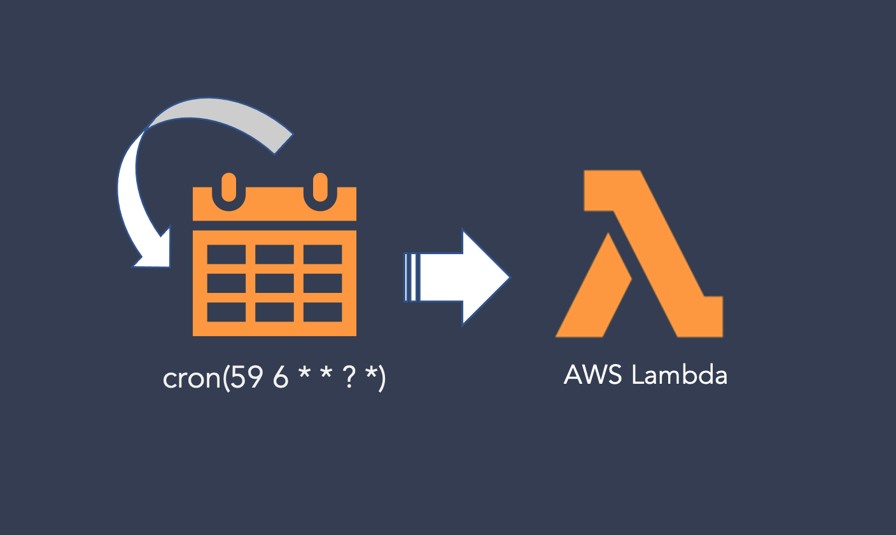
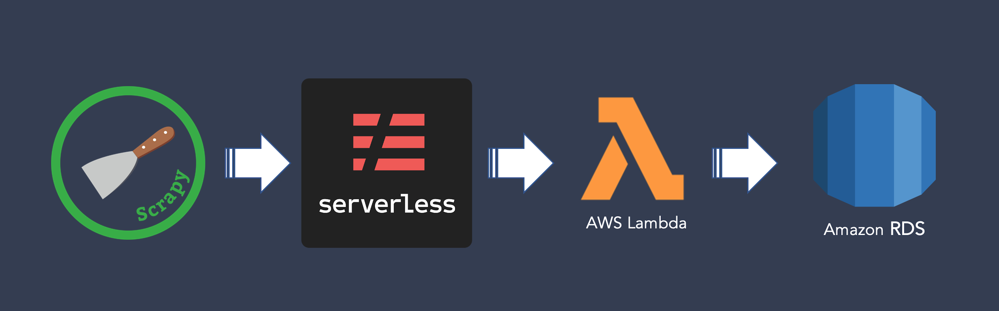

<p className="lead">
  How do I build an automated ETL pipeline from a simple web scraper? Over two posts, I
  document the resources I leverage to periodically extract solar irradiance and
  meteorological data from the Solar Energy Research Institute's (SRRL) online portal.
  This second post will focus on automating the ETL pipeline.
</p>



[Last time out](https://kim-sha.github.io/nrel/scraper/), I built an ETL pipeline
on top of the Scrapy framework to gather data from NREL's station in Golden, CO.
As much as I'd enjoy dedicating my remaining days to manually triggering this web
scraper, I can't let it conflict with my Netflix schedule. Fortunately, I'm told
some guy built a slew of somewhat profitable services for this exact reason.
His name is Jeff.

## Core Tools

I've already been using one of Jeff's 'somewhat profitable' offerings -
Amazon RDS - to host my Postgres instance. This time round, I'll be
leveraging [AWS Lambda](https://docs.aws.amazon.com/lambda/latest/dg/welcome.html),
a compute service that allows me to farm off code that can be triggered in response
to manual invocations, network requests, and events. We'll be running the scraper
as a scheduled event, i.e., a cron job.

This is where [Serverless](https://www.serverless.com/framework/docs/providers/aws/guide/intro/)
comes in. As a framework, it handles much of the infrastructure required to
build and deploy an application using
[serverless code patterns](https://www.serverless.com/blog/serverless-architecture-code-patterns).
My use-case will be fairly simple: deploy 1 service to AWS Lambda comprised of
1 function that's triggered daily.

1. If you haven't done so already, set up an
[AWS account](https://aws.amazon.com/free/?all-free-tier.sort-by=item.additionalFields.SortRank&all-free-tier.sort-order=asc).
2. Install the Serverless framework with `npm install -g serverless` (requires Node.js and NPM)
3. Install [Docker](https://www.docker.com/), which will be used to bundle
python dependencies for deployment.

## Configuring Serverless Access to AWS

In the root of the `nrel-scraper` project folder (containing `scrapy.cfg`), we
initialize and name a service from a template:
```shell
$ serverless create --template aws-python3 --name nrel-scraper
```
This will hook us up with a series of [configurations](https://www.serverless.com/framework/docs/providers/aws/guide/serverless.yml/)
provided in `serverless.yml`, a `.gitignore`, and a `handler.py` script (more on that below).

Next you'll want to [generate some AWS access keys](https://www.youtube.com/watch?v=KngM5bfpttA)
for Serverless latch on to. If you insist on being a Road Runner, you
can dump them into a gitignored dotenv file and export them as environment variables
in your shell (`source .env`) before deployment. I prefer the more permanent
solution of setting up AWS profiles under `~/.aws/credentials`:
```ini
[serverless-admin]
aws_access_key_id = ********************
aws_secret_access_key = ********************
```
There are several ways to invoke different profiles during deployment, but for
my purposes it's sufficient to just edit the provider field in `serverless.yml`:
```yaml
provider:
  name: aws
  runtime: python3.7
  lambdaHashingVersion: 20201221
  profile: serverless-admin
```

## Packaging the Function

Up to this point, we've been manually invoking the scraper with `scrapy crawl midc`.
Jeff wants us to package this into a neat function that handles `event` and
`context` objects that are passed to it. You can read more about these arguments
[here](https://docs.aws.amazon.com/lambda/latest/dg/python-handler.html).

Recall that intializing Serverless provided us a `handler.py`. Since I'm not
passing any `event` data for the Lambda function to process, my handler function
is excruciatingly boring:

```python
# ./handler.py

import json
import sys
from nrel_scraper.crawl import crawl

def scrape(event={}, context={}):
    crawl()

if __name__ == "__main__":
    try:
        event = json.loads(sys.argv[1])
    except IndexError:
        event = {}
    scrape(event)
```

The imported `crawl` method just replicates the manual invocation of the scaper
by using [Scrapy API](https://docs.scrapy.org/en/latest/topics/practices.html)
(pardon the hacky [sqlite3 hotfix](https://stackoverflow.com/questions/52291998/unable-to-get-results-from-scrapy-on-aws-lambda)
I had to dirty my hands with):

```python
# ./nrel_scraper/crawl.py

import scrapy
from scrapy.spiderloader import SpiderLoader
from scrapy.crawler import CrawlerProcess
from scrapy.utils.project import get_project_settings

# Start sqlite3 fix
import imp
import sys
sys.modules["sqlite"] = imp.new_module("sqlite")
sys.modules["sqlite3.dbapi2"] = imp.new_module("sqlite.dbapi2")
# End sqlite3 fix

def crawl(spider_name="midc", spider_kwargs={}):

    project_settings = get_project_settings()
    spider_loader = SpiderLoader(project_settings)
    spider_cls = spider_loader.load(spider_name)

    process = CrawlerProcess(project_settings)
    process.crawl(spider_cls, **spider_kwargs)
    process.start()
```

## Managing Dependencies

Don't forget the never-ending joy of [bundling dependencies](https://www.serverless.com/blog/serverless-python-packaging)
so that they'll be provisioned 'in the cloud'. I'll use pipenv to spawn a virtual
Python 3 environment:
```shell
$ pipenv --three
$ pipenv shell
$ pipenv install <for_each_package>
$ pipenv lock
```
The required packages for `nrel-scraper` are Scrapy, sqlalchemy, pandas,
python-dotenv, and psycopg2-binary. If you ever needed proof of
how over-engineered this simple scraper is, that list of bloated
packages should do the trick.

Serverless will need to bundle these dependencies specified in the newly
generated `Pipfile`. Fortunately, there's a handy [plugin](https://www.serverless.com/plugins/serverless-python-requirements)
for this purpose:
```shell
$ serverless plugin install -n serverless-python-requirements
```
The plugin will be automatically added to the `package.json` and `serverless.yml`.
We'll also need to add a custom field to the latter enabling the usage of Docker
to compile packages that aren't native to Python:
```yaml
plugins:
  - serverless-python-requirements
custom:
  pythonRequirements:
    slim: true # Omits tests, __pycache__, *.pyc etc
    usePipenv: true
    dockerizePip: non-linux
```

## Serverless Deployment



All that's left is to rehaul the functions field in `serverless.yml` to schedule
the cron job and point to the correct handler method. Note that all
[cron expressions](https://docs.aws.amazon.com/AmazonCloudWatch/latest/events/ScheduledEvents.html#CronExpressions)
should be passed in UTC:
```yml
functions:
  nrelScrape:
    # handler method for nrel-scraper
    handler: handler.scrape
    # Seconds until function times out
    timeout: 30 
    events:
      # Definition of the cron job that's passed to AWS CloudWatch
      - schedule:
          name: nrel-midc-daily-ingestion
          description: Scheduled daily scraping of NREL MIDC at 11:59PM MST (UTC-7:00)
          rate: cron(59 6 * * ? *)
```
This wraps up our `serverless.yml`. You can learn more from this
[example reference](https://www.serverless.com/framework/docs/providers/aws/guide/serverless.yml/)
or check out the [GitHub repo](https://github.com/Kim-Sha/nrel-scraper) for this project.
But first, deploy!

```shell
$ serverless deploy --verbose
```
The function will now self-trigger according to the schedule dictated to
CloudWatch. You that can still manually trigger the job to run on Lambda:
```shell
$ serverless invoke -f nrelScrape --log
```
If by some miracle, the permissions across Amazon RDS, Lambda, and Serverless
are all perfectly aligned, c'est fini. Personally, I had to do some
[troubleshooting](https://aws.amazon.com/premiumsupport/knowledge-center/lambda-rds-connection-timeouts/)
to grease the wheels.

Okay! We're done here. My own mother wouldn't have made it through this slog.
So if you have, I'm sorry? Now, we sit back and let the solar irradiance and
meteorological data from the finely calibrated pyranometers
and pyrheliometers of the Solar Energy Research Institute's Baseline Measurement
System roll in...