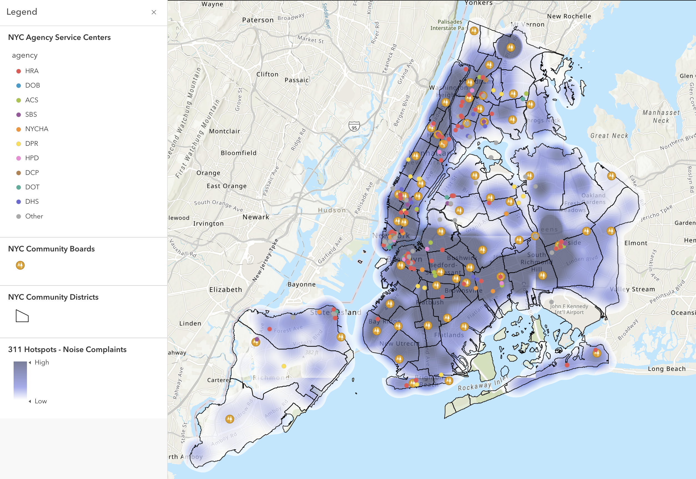
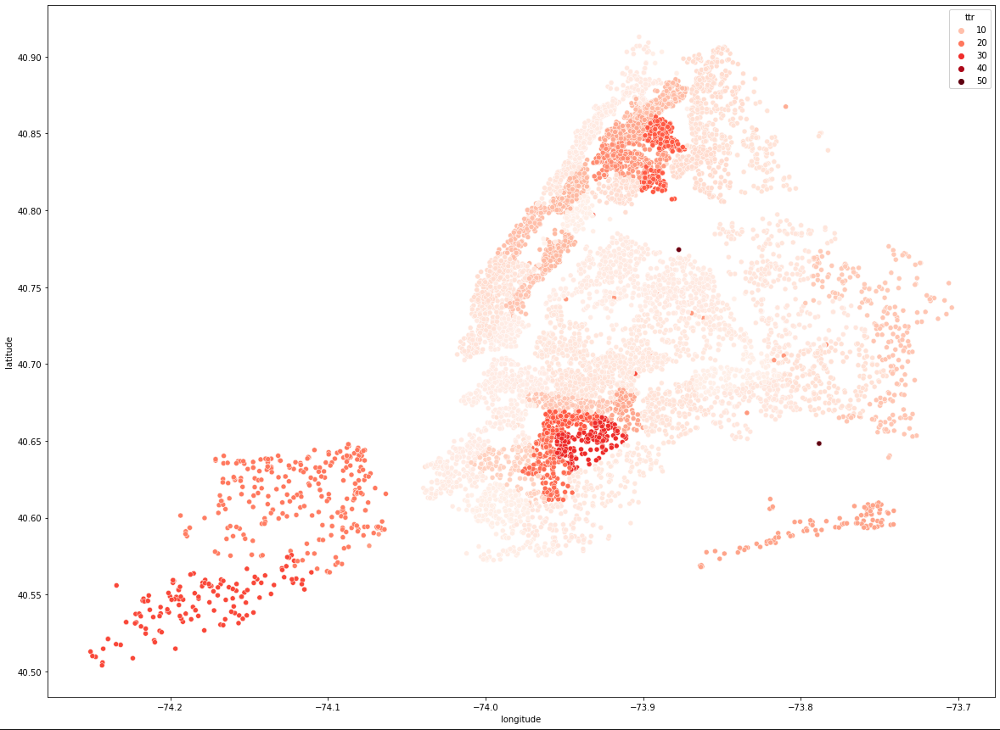

import { volume_by_medium, volume_by_complaint, volume_by_agency,
         volume_by_agency_complaint_sunburst, volume_by_tod_heatmap } from '../nyc311_figures'

  Urban soft systems include the social, cultural, and economic networks that
  are critical to the human side of cities, but are comparatively invisible
  compared to hard (engineered) systems. This three-part series will look at
  a particularly salient system for residents of NYC: the 311 reporting service.

#### ArcGIS: Geographic Patterns

**N.B. ArcGIS Map:** https://arcg.is/8ifnL

The *nodes* of this network are the City agencies and 59 local community boards across the city. It would also be fair to suggest the nodes be the call centers that handle 311 service requests, but that would conflating the system with network #1 above. In addition, these call centers are not the political decision-making units that determine which work orders should be carried out to address concerns. Instead, it is the main responsibility of the community board office to assess the needs of their neighborhoods, receive complaints from residents, and meet with City agencies to make recommendations on actionable items. To this end, Local Law 47 of 2005 requires the Department of Information Technology and Telecommunications (DoITT) to issue monthly reports to community boards and the public. 

The *agents* in this network are the operators that correspond to the nodes described above. Ultimately, the boards serve as advocates but tasks are performed by agency officials and employees. The community boards themselves each consist of up to 50 non-salaried members appointed by the Borough President. And by far the most prevalent agents in this data will be the 311 reporters themselves. The 311 data links agents in these communities through a shared involvement and interest in the wellbeing of the neighborhood. These agents can be any member of the community that resides, works, or has some other significant interest in the area.

The process *flow* of this network has been hinted above. Over time, service requests flow from neighborhood residents to community boards (through the aforementioned Local Law 47 of 2005), before they're advocated for to city agencies. In turn, there is a flow back into the community of responses and fixes to issues raised.

